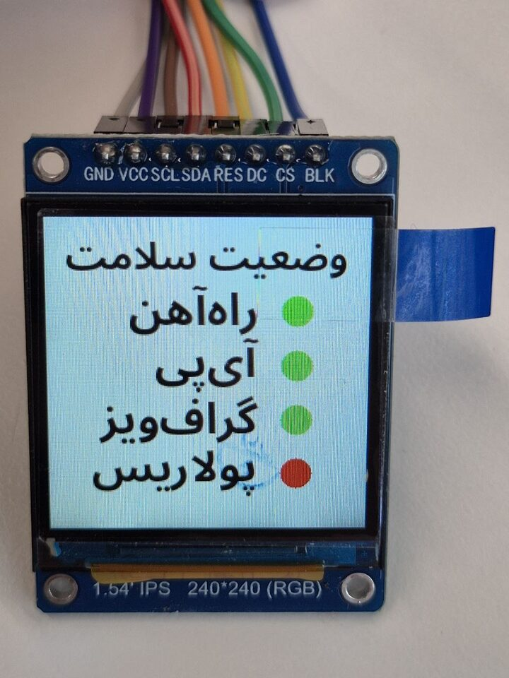

# ESP32 Service Health Panel

An ESP32-S3 firmware project written in Rust that turns a 240x240 ST7789 LCD into a small
always-on service health panel. It connects to Wi-Fi, checks the configured HTTP and Railway
endpoints on a 10-minute cycle, and shows a Persian status screen with green or red dots for
each service.



## Hardware Wiring

| LCD Pin | ESP32-S3 GPIO |
|---------|--------------|
| VCC     | 3V3          |
| GND     | GND          |
| SCL/SCK | GPIO12       |
| SDA/MOSI| GPIO11       |
| RES/RST | GPIO10       |
| DC/A0   | GPIO9        |
| CS      | GPIO8        |
| BL      | 3V3 (always on) |

## Arch Linux Setup

### 1. Install espup (ESP32 Rust toolchain manager)

```bash
sudo pacman -S --needed libxml2-legacy  # ESP-IDF clang needs the legacy libxml2 ABI
cargo install espup
espup install   # Install the xtensa-esp32s3-espidf toolchain
source ~/export-esp.sh  # Required in every new terminal
```

This project includes `rust-toolchain.toml`, so it automatically uses the `esp` Rust toolchain.

### 2. Install espflash

```bash
cargo install espflash
cargo install ldproxy
```

### 3. Serial port permissions (avoid sudo each time)

```bash
sudo usermod -aG uucp $USER  # Arch usually uses uucp; other distros may use dialout
# Log out and back in for the change to take effect
# Check:
ls -la /dev/ttyACM0
```

### 4. Check ESP-IDF (installed by espup)

```bash
# After espup finishes, the files are usually under ~/.espressif/
# Confirm that export-esp.sh exists:
ls ~/export-esp.sh
```

## Build & Flash

### Wi-Fi Credentials

Store the Wi-Fi SSID and password in `.env`. Start by copying the template:

```bash
cp .env.example .env
```

`.env` contents:

```dotenv
WIFI_SSID=your Wi-Fi name
WIFI_PASS=your Wi-Fi password
RAILWAY_TOKEN=your Railway token
RAILWAY_PROJECT_ID=your Railway project ID
RAILWAY_SERVICE_ID=your Railway service ID
RAILWAY_ENVIRONMENT_ID=your Railway environment ID
```

For an open network, leave `WIFI_PASS` empty. If `WIFI_SSID` is not set, the firmware treats
Wi-Fi login as failed and marks the status checks as failed.

Important: ESP32-S3 only supports **2.4 GHz Wi-Fi** and cannot connect to **5 GHz Wi-Fi**.
If your router exposes separate `xxx_5G` / `xxx_2G` SSIDs, put the 2.4 GHz one in `.env`,
for example `xxx_2G`. Connecting to a 5 GHz SSID will time out, and the serial monitor may show
`ESP_ERR_TIMEOUT`.

```bash
# Enter the project directory
cd esp32-lcd-test

# Source this in every new terminal
source ~/export-esp.sh

# Build (the first build is slow because it compiles ESP-IDF)
cargo build --release

# Flash the app and open the serial monitor
# If the bootloader is already on the board, this is usually enough
cargo run --release

# Or do it in separate steps and update only the app:
cargo build --release
espflash flash --flash-mode dout --flash-freq 20mhz --flash-size 16mb \
  target/xtensa-esp32s3-espidf/release/esp32-lcd-test --monitor
```

After connecting, the serial monitor shows `Wi-Fi connected` and the DHCP IP information.
The firmware then immediately checks four endpoints, repeats the checks every 10 minutes,
and updates the LCD:

```text
https://uk-railway-journey-recorder-api.shn.hk/api/health
https://ipinfo.shn.hk/
https://backboard.railway.com/graphql/v2
https://syv.red/zh-TW
```

- The first endpoint must return HTTP 200 with a body of `{"status":"ok"}`.
- The second endpoint must return HTTP 200, and the first response line must be an IP address.
- The third endpoint queries Railway GraphQL for the latest deployment of the configured service.
  It passes only when the response is HTTP 200 and `status` is `"SUCCESS"` or `"SLEEPING"`.
- The fourth endpoint is Polaris and must return HTTP 200.

The LCD shows green dots only when the corresponding health checks succeed. If Wi-Fi login fails,
`WIFI_SSID` is missing, any required env var is missing, an HTTPS request fails, or any health
check does not match the expected result, the corresponding status dot is shown in red.
Because `.env` values are compiled into the firmware, rerun `cargo run --release` after changing
the SSID, password, or Railway settings.

This board's embedded flash fails during the ROM stage with DIO/40 MHz and shows
`Invalid image block, can't boot.`. `sdkconfig.defaults` pins the flash configuration to
DOUT/20 MHz.

If you just erased flash, switched boards, or see the bootloader error again, write the bootloader,
partition table, and app together first:

```bash
source ~/export-esp.sh
cargo build --release

PROJECT_DIR=$PWD
IDF_BUILD_DIR=$(
  find target/xtensa-esp32s3-espidf/release/build -path '*/out/build/flash_args' \
    -printf '%T@ %h\n' | sort -n | tail -1 | cut -d' ' -f2-
)

sudo espflash flash \
  --chip esp32s3 --port /dev/ttyACM0 \
  --flash-mode dout --flash-freq 20mhz --flash-size 16mb \
  --bootloader "$IDF_BUILD_DIR/bootloader/bootloader.bin" \
  --partition-table "$PROJECT_DIR/.embuild/espressif/esp-idf/v5.2.3/components/partition_table/partitions_singleapp.csv" \
  --partition-table-offset 0x8000 \
  --monitor target/xtensa-esp32s3-espidf/release/esp32-lcd-test
```

## Screen States

After boot, the screen states are:

1. **Blue background with a centered white Persian title**: boot screen, shown immediately after LCD initialization
2. **White background with a centered Persian title and right-side status dots**: each service is shown as green when healthy or red when failed

The Persian status text on the status screen is pre-rendered as bitmaps:

1. Centered title: `وضعیت سلامت`
2. `راه‌آهن` with a status dot on the right
3. `آی‌پی` with a status dot on the right
4. `گراف‌ویز` with a status dot on the right
5. `پولاریس` with a status dot on the right

The Persian bitmaps are generated by `tools/generate_persian_status.py`. To change the text,
font, or positioning, edit that script and regenerate:

```bash
python3 tools/generate_persian_status.py
cargo fmt
```

The script requires Python Pillow with RAQM shaping support. The default font is
`NotoSansArabic-Bold.ttf`. Regeneration updates `src/persian_status.rs` and writes a preview to
`target/persian_status_preview.png`.

## Troubleshooting

### Screen stays all white or all black

- Confirm BL (backlight) is connected to 3V3
- Confirm RES is connected to GPIO10, not directly to 3V3
- Use an oscilloscope or logic analyzer to confirm GPIO12 has the SPI clock

### Colors are swapped (red and blue reversed)

- Change the `MADCTL` value from `0x00` to `0x08` (RGB/BGR bit)

### Screen is shifted or offset

- Some 1.54" ST7789 modules have row/column offsets
- Add an offset in `set_window`:
  ```rust
  // If the screen is offset by (ox, oy), for example ox=0, oy=80
  const OFFSET_X: u16 = 0;
  const OFFSET_Y: u16 = 0;  // Try 0 first; if it is wrong, try 80
  ```

### Build cannot find the xtensa target

```bash
# Confirm the toolchain is installed
rustup toolchain list | grep xtensa
# Confirm export-esp.sh has been sourced
echo $PATH | grep xtensa
```

### espflash cannot find the port

```bash
espflash list-ports
espflash flash --port /dev/ttyACM0 target/.../esp32-lcd-test --monitor
```
